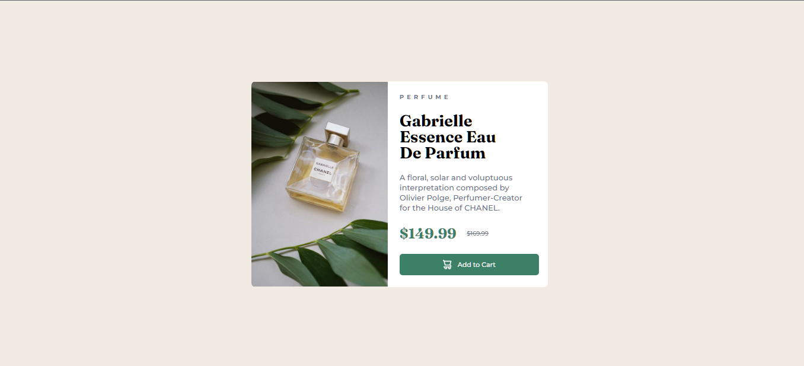

# Frontend Mentor - Product Preview Card Component Solution

This is a solution to the [Product Preview Card Component challenge on Frontend Mentor](https://www.frontendmentor.io/challenges/product-preview-card-component-GO7UmttRfa). Frontend Mentor challenges help you improve your coding skills by building realistic projects.

## Overview

### The challenge

Users should be able to:

- View the optimal layout depending on their device's screen size
- See hover and focus states for interactive elements

### Screenshot

### Links

- [Solution URL](https://github.com/sliyarli/product-preview-card-component)
- [Live Site URL](https://sliyarli.github.io/product-preview-card-component/)

## My Process

### Built with

- Semantic HTML5 markup
- CSS custom properties
- Flexbox
- Mobile-first workflow

### What I learned

Through this project, I learned the importance of responsive design and how to create layouts that adapt gracefully to different screen sizes. I also gained a deeper understanding of CSS properties such as `background-size` and how they affect the display of background images.

### Continued Development

While completing this project, I realized that I want to further enhance my knowledge of CSS Flex layouts and explore more advanced techniques for responsive typography. Additionally, I plan to delve into JavaScript to add interactive features and improve user experience.

### Useful Resources

- [MDN Web Docs](https://developer.mozilla.org/) - An invaluable resource for learning HTML, CSS, and JavaScript.
- [CSS-Tricks](https://css-tricks.com/) - A comprehensive guide to various CSS techniques and tricks.
- [Frontend Mentor Community](https://www.frontendmentor.io/community) - The community forum provided helpful insights and solutions during the project.

## Author

- Frontend Mentor - [@sliyarli](https://www.frontendmentor.io/profile/sliyarli)
